# Julia Pereira

This portfolio highlights my practical experience in secure software development, web application security, penetration testing, and system design. Every project demonstrates real-world skills in building, testing, and securing applications using industry best practices.

---
## Project 1: Secure Portfolio Website
A responsive personal portfolio website designed and developed entirely from scratch using HTML, CSS, and JavaScript. Beyond showcasing my work, this project demonstrates my ability to build modern web applications while incorporating secure coding practices and performing security assessments to identify and remediate vulnerabilities.
*[Click Here to view the Live website](https://techielbird.github.io/julia-pereira-portfolio/)*

### Key Features
- Responsive and modern user interface
- Professional project showcase
- Optimized performance

### Homepage 
A professional homepage that introduces my cybersecurity expertise, along with a personal mission statement and career goals.
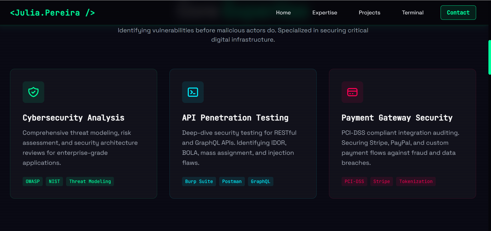

### Portfolio Projects 
In-depth showcases of individual projects, explaining challenges, solutions, and the security measures implemented.
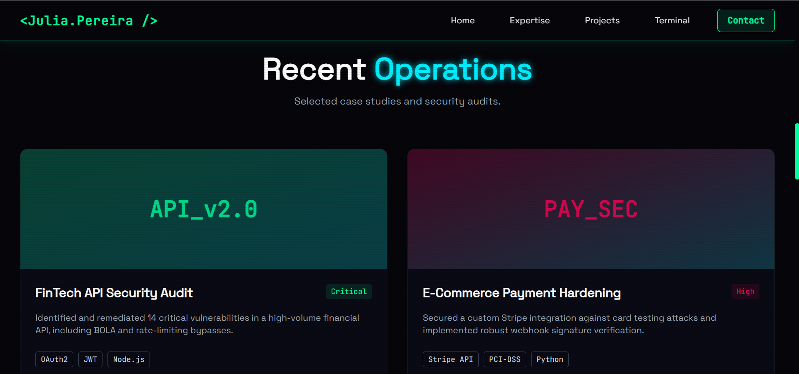
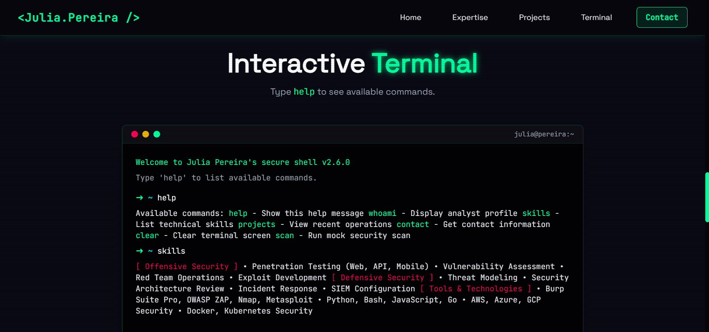

### Contact Section
A dedicated area with contact details and a simple form for inquiries, partnerships, or networking.
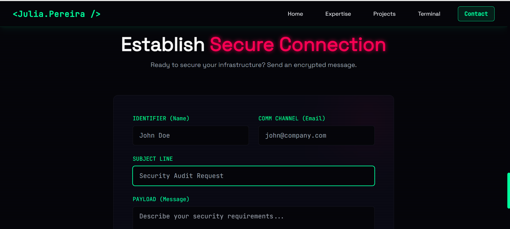
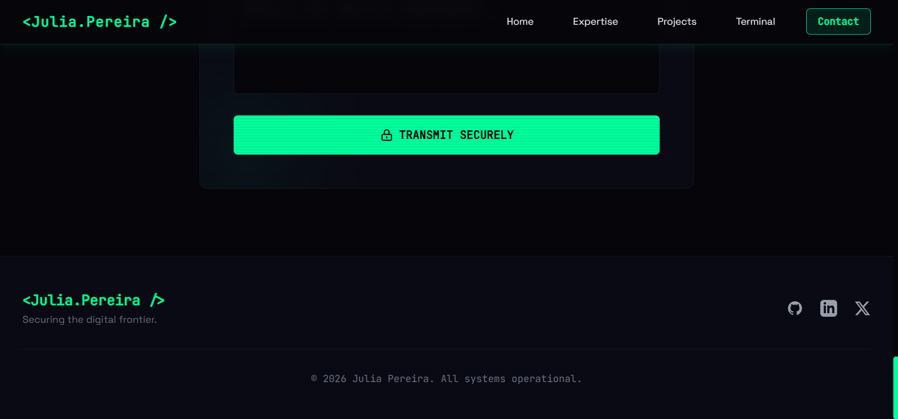

### Technologies Used
- HTML5
- CSS3
- JavaScript
- Git & GitHub

### Security Assessment
As part of this project, I performed a complete security assessment of the website by:

- Identifying common web application vulnerabilities
- Testing for Cross-Site Scripting (XSS)
- Testing for SQL Injection where applicable
- Validating input sanitization
- Reviewing authentication and authorization logic
- Assessing HTTP Security Headers
- Evaluating client-side JavaScript security
- Verifying secure deployment configurations

### Skills Demonstrated
- Frontend Web Development
- Secure Web Development
- Web Application Penetration Testing
- Vulnerability Assessment
- Security Best Practices
- UI/UX Design

## Project 2: Point of Sale (POS) System
A complete retail management application built to automate store inventory tracking, log daily transactional revenues, and render downloadable customer invoice receipts.
*[Click Here to Open the Live Project](https://lb1rd2.github.io/pos/?)*

### Login Page
A secure authentication interface that restricts access to authorized users, helping protect business data and ensuring only authenticated personnel can access the POS system.
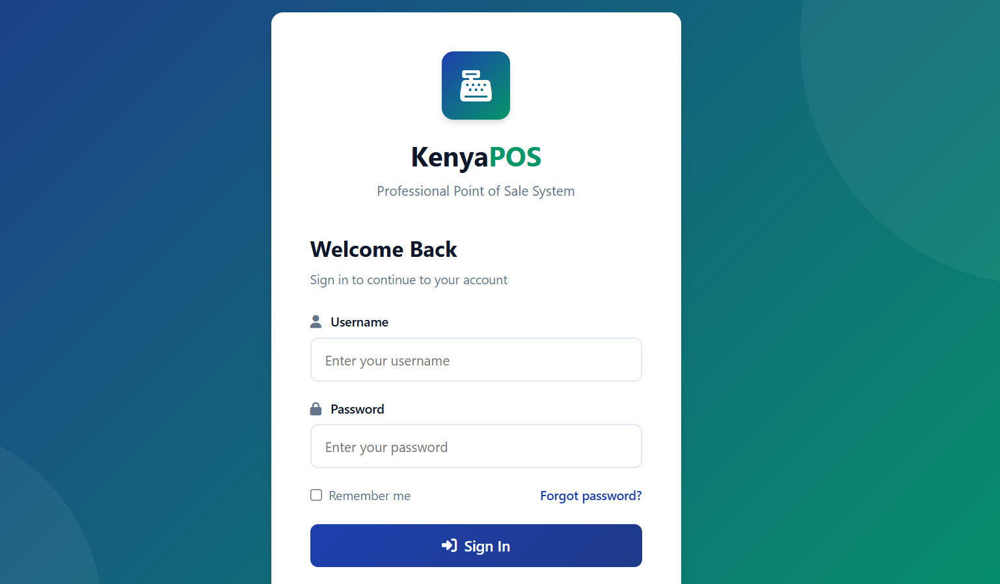

### Dashboard
A centralized dashboard providing an overview of sales performance, inventory status, and key business metrics for quick decision-making. Process customer purchases quickly through an intuitive sales interface with automatic total calculations and receipt generation.
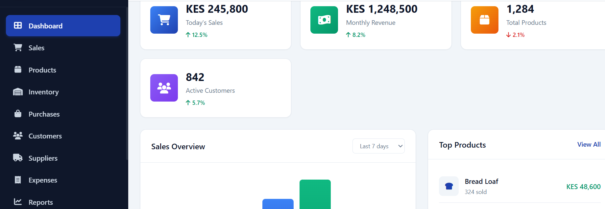

### System Interface
A clean, responsive, and user-friendly interface designed to simplify retail operations and enhance the overall user experience.
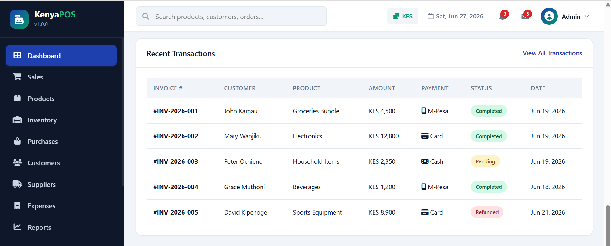

### Inventory & Stock Tracking
Monitor stock levels in real time, helping prevent shortages, reduce overstocking, and improve inventory management.**
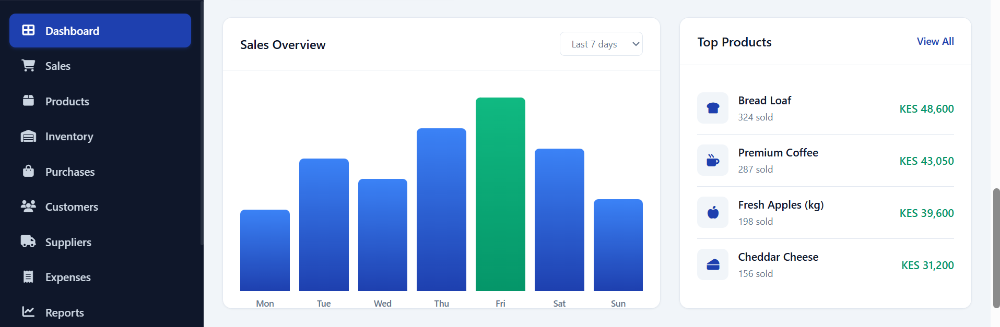

### Product Management
Manage products efficiently by adding, editing, deleting, and organizing inventory with real-time stock updates.
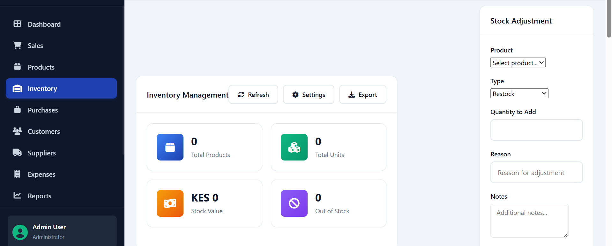

### Inventory & Stock Tracking
Monitor stock levels in real time, helping prevent shortages, reduce overstocking, and improve inventory management.
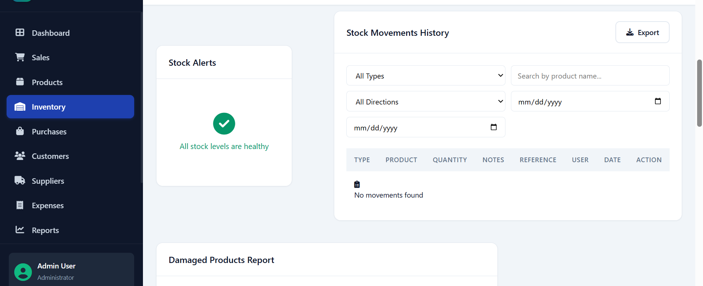

## My Achievements

  

  

  

