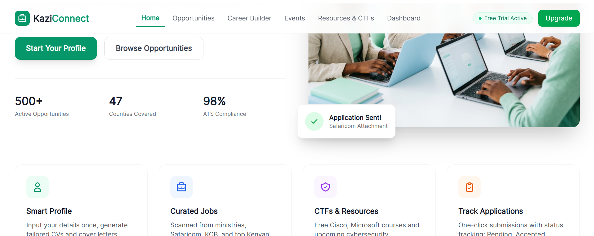
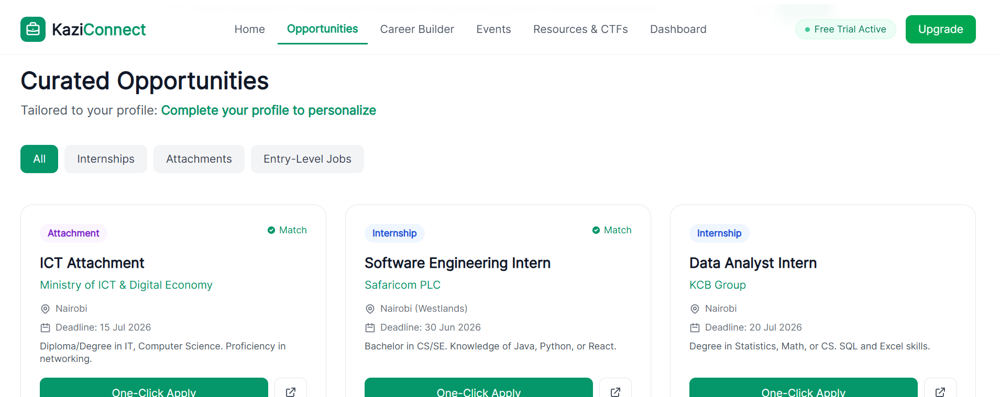
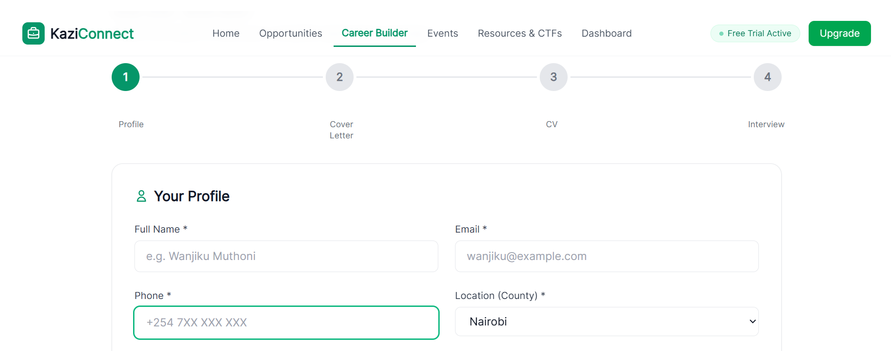
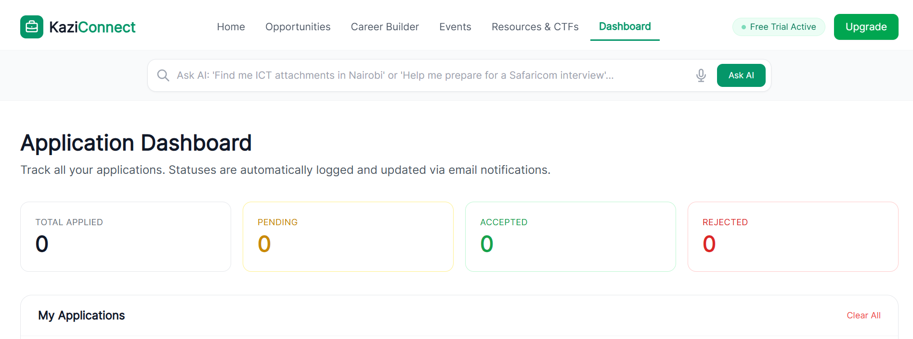
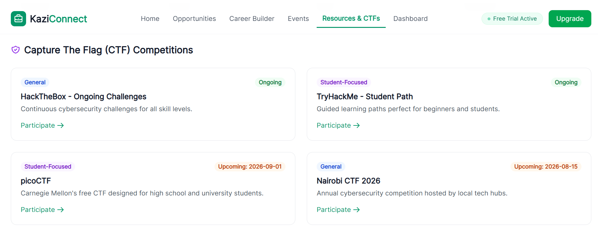

# Julia Pereira

This portfolio highlights my practical experience in secure software development, web application security, penetration testing, and system design. Every project demonstrates real-world skills in building, testing, and securing applications using industry best practices.

---
## 🚀 My Security Portfolio

Here you can find individual deep-dives into my lab environments.

## PROJECT 1

# 🇰🇪 KaziConnect Kenya: AI-Powered Career Platform

> **Bridging the gap between Kenyan graduates and career success through AI, automation, and secure data handling.**

## Overview
KaziConnect Kenya is a full-stack web application designed to streamline the job search process for students and entry-level professionals in Kenya. It aggregates opportunities from government ministries and top corporations (Safaricom, KCB), utilizes LLMs to generate ATS-compliant application materials, and provides a secure dashboard for tracking applications. 

Additionally, the platform fosters technical growth by hosting **Cybersecurity CTF Challenges** and curated learning resources.

## Key Features
*   **Smart Profile & AI Document Generator**: Instantly generates tailored, ATS-compliant CVs and Cover Letters in PDF format.
  

*   **Automated Job Aggregation**: Scrapes and curates entry-level jobs from diverse portals (Ministries, Tech Hubs, Corporate sites).
  

*   **AI Mock Interviewer**: An interactive LLM-driven interview simulator with real-time feedback.
  

    **Application Dashboard**: Real-time tracking of application statuses (Pending, Accepted, Rejected).

*   **Cybersecurity Hub**: Hosts CTF challenges and curated resources (Cisco, Microsoft) for skill development.
  
  ---

## Cybersecurity & Data Privacy (AppSec)
*Given the sensitive nature of user data (PII, employment history, academic records), security was prioritized at the architecture level.*

*   **Data Protection & Compliance**: Designed with the **Kenya Data Protection Act (2019)** in mind. All PII is encrypted at rest and in transit (TLS 1.3).
*   **OWASP Top 10 Mitigation**: Implemented strict input validation and output encoding to prevent XSS and SQL Injection. Parameterized queries are used across the database.
*   **AI Security (Prompt Injection Defense)**: Secured LLM endpoints (Cover Letter/Mock Interview) against prompt injection and jailbreaking attempts using input sanitization and system prompt hardening.
*   **Secure Web Scraping Pipeline**: The job aggregation engine uses isolated, sandboxed environments to scrape external sites, preventing Server-Side Request Forgery (SSRF) and ensuring malicious payloads from external sites are neutralized before database insertion.
*   **Authentication & Authorization**: Implemented secure, stateless authentication using JWTs with short expiration times and secure HttpOnly cookies.

*(See [SECURITY.md](./SECURITY.md) for our full vulnerability disclosure policy and security architecture).*

---

## Software Engineering & AI Integration
*   **Full-Stack Architecture**: Built using `Frontend Framework, React/Next.js` and `Backend, Node.js/Python FastAPI`.
*   **AI Orchestration**: Integrated `LLM Provider, OpenAI API/Claude` via custom prompt engineering to ensure CVs and cover letters maintain professional formatting and context.
*   **Programmatic PDF Generation**: Developed a custom engine using `Library, PDFKit/React-PDF` to render dynamic, ATS-friendly documents without relying on heavy external dependencies.
*   **State Management**: Built a robust relational database schema `PostgreSQL` to handle complex many-to-many relationships between users, applications, and job listings.

---

## Tech Stack
*   **Frontend:** React, Tailwind CSS, TypeScript
*   **Backend:** Python FastAPI, Node.js
*   **Database:** PostgreSQL, Redis
*   **AI/ML:** OpenAI API, LangChain, HuggingFace
*   **DevOps/Cloud:** Docker, AWS/GCP, GitHub Actions

---

## System Architecture
<!-- *(Insert a diagram here using Mermaid.js or an image. Show the flow from Frontend -> API Gateway -> Backend Services -> Database & LLMs)* -->

## Getting Started
<!-- [Provide clear instructions on how to clone, install dependencies, set up `.env` variables, and run the project locally.] -->

## 📬 Contact & Live Demo
*   **Live Deployment:** [Live Deployment](https://chat.qwen.ai/s/deploy/t_4b7a324d-300c-40b1-a42d-b1979293599f)
*   **LinkedIn:** [Linkedin](www.linkedin.com/in/julia-pereira-cyber-security-analyst)
*   **Portfolio:** [Portfolio](https://lb1rd2.github.io/portfolio/)

## Project 2: Secure Portfolio Website
A responsive personal portfolio website designed and developed entirely from scratch using HTML, CSS, and JavaScript. Beyond showcasing my work, this project demonstrates my ability to build modern web applications while incorporating secure coding practices and performing security assessments to identify and remediate vulnerabilities.
*[Click Here to view the Live website](https://techielbird.github.io/julia-pereira-portfolio/)*

### Key Features
- Responsive and modern user interface
- Professional project showcase
- Optimized performance

### Homepage 
A professional homepage that introduces my cybersecurity expertise, along with a personal mission statement and career goals.

### Portfolio Projects 
In-depth showcases of individual projects, explaining challenges, solutions, and the security measures implemented.

### Contact Section
A dedicated area with contact details and a simple form for inquiries, partnerships, or networking.

### Technologies Used
- HTML5
- CSS3
- JavaScript
- Git & GitHub

### Security Assessment
As part of this project, I performed a complete security assessment of the website by:

- Identifying common web application vulnerabilities
- Testing for Cross-Site Scripting (XSS)
- Testing for SQL Injection where applicable
- Validating input sanitization
- Reviewing authentication and authorization logic
- Assessing HTTP Security Headers
- Evaluating client-side JavaScript security
- Verifying secure deployment configurations

### Skills Demonstrated
- Frontend Web Development
- Secure Web Development
- Web Application Penetration Testing
- Vulnerability Assessment
- Security Best Practices
- UI/UX Design

## Project 3: Point of Sale (POS) System
A complete retail management application built to automate store inventory tracking, log daily transactional revenues, and render downloadable customer invoice receipts.
*[Click Here to Open the Live Project](https://lb1rd2.github.io/pos/?)*

### Login Page
A secure authentication interface that restricts access to authorized users, helping protect business data and ensuring only authenticated personnel can access the POS system.

### Dashboard
A centralized dashboard providing an overview of sales performance, inventory status, and key business metrics for quick decision-making. Process customer purchases quickly through an intuitive sales interface with automatic total calculations and receipt generation.

### System Interface
A clean, responsive, and user-friendly interface designed to simplify retail operations and enhance the overall user experience.

### Inventory & Stock Tracking
Monitor stock levels in real time, helping prevent shortages, reduce overstocking, and improve inventory management.**

### Product Management
Manage products efficiently by adding, editing, deleting, and organizing inventory with real-time stock updates.

### Inventory & Stock Tracking
Monitor stock levels in real time, helping prevent shortages, reduce overstocking, and improve inventory management.

## Remote File Transfer and PowerShell Fundamentals

This project demonstrates my understanding of secure file transfer techniques and PowerShell-based file delivery methods used in Windows environments from a cybersecurity and system administration perspective.

The work covers multiple approaches to transferring files between local and remote systems, including Remote Desktop Protocol (RDP) through Drive and Clipboard Redirection, Secure File Transfer Protocol (SFTP) over SSH, and PowerShell-based file transfer mechanisms. It also explores PowerShell Base64 encoding and decoding techniques for transferring files without network communication, as well as the use of MD5 hashing to verify file integrity after transfer.

The project further examines PowerShell capabilities for downloading remote resources using the System.Net.WebClient class (DownloadFile(), DownloadFileAsync()) and Invoke-WebRequest (IWR). In addition, it introduces memory-based execution concepts using DownloadString() and Invoke-Expression (IEX), providing insight into techniques commonly encountered during system administration and cybersecurity assessments.

## My Achievements

  

  

  

