

  

# 🟢 [YOUR NAME] | FULL-STACK DEVELOPER & PENETRATION TESTER
### 🛡️ AppSec Specialist (CEH & CASA Certified)

> I build secure digital solutions for businesses, proactively testing their platforms to find and eliminate critical vulnerabilities before deployment.

### 💼 Let's Work Together
🚀 *Looking to build a secure system or audit your current platforms?* Click a button below to connect immediately:

<a href="YOUR_CV_LINK_HERE" download><button>📄 Download My CV</button></a>
<a href="mailto:your.email@://example.com"><button>📧 Email Me</button></a>
<a href="https://wa.me."><button>💬 WhatsApp Chat</button></a>
<a href="tel:YOUR_PHONE_NUMBER_HERE"><button>📞 Call Me Direct</button></a>

---

### 🛠️ Tech Stack & Expertise
* *Development & Architecture:* HTML5, CSS3, JavaScript, React, Node.js, Python, Databases, Bash
* *Vulnerability Assessment & Testing:* OWASP Top 10, API Security, Burp Suite, Metasploit, Wireshark
* *Core Credentials:* Certified Ethical Hacker (CEH) | Certified API Security Analyst (CASA)
* *Current Focus:* Creating high-performance software and performing advanced API/cloud security assessments.
*
---

## About

I am a Cybersecurity Analyst and Penetration Tester passionate about identifying vulnerabilities and helping organizations improve their security posture. I specialize in web application security, API security testing, vulnerability assessments, and ethical hacking. Through hands-on labs, real-world projects, and continuous learning, I continue to strengthen my technical skills and stay current with evolving cybersecurity threats and defensive strategies.

---

## Skills

### Security Testing
- Penetration Testing
- Vulnerability Assessment
- Web Application Security
- API Security Testing
- Network Security Assessment

### Tools
- Burp Suite
- Postman
- Nmap
- Wireshark
- Metasploit
- OWASP ZAP
- Nessus
- Gobuster

### Programming
- Python
- JavaScript
- Html
- CSS

---

## Projects & Labs
**My Security Portfolio**

Here you can find individual deep-dives into my lab environments, penetration testing projects, security assessments, and technical writeups.

## PROJECT 1

# KaziConnect

## Project Overview

KaziConnect is an AI-powered career platform built for Kenyan students and graduates to discover relevant internships, attachments, and entry-level jobs, improve their CVs, prepare for interviews, and manage their job applications in one place.

## Live Demo

🔗 *[View Live Project](https://chat.qwen.ai/s/deploy/t_4b7a324d-300c-40b1-a42d-b1979293599f)*

## What Does It Do?

KaziConnect helps students and graduates:

- Find internships, attachments, and entry-level jobs.
- Discover opportunities from government ministries, companies, and tech hubs.
- Use AI to find opportunities that match their skills and profile.
- Build ATS-friendly CVs.
- Prepare for interviews.
- Track job applications and deadlines.

## Who Is It For?

KaziConnect is primarily designed for:

- Kenyan university and college students
- Recent graduates
- Entry-level job seekers
- Students looking for industrial attachments
- Students looking for internships

## What Problem Does It Solve?

Many Kenyan students and graduates struggle to find relevant career opportunities, identify opportunities that match their skills, create effective CVs, prepare for interviews, and keep track of multiple applications.

## How Does It Solve the Problem?

KaziConnect brings the career search process into one platform. It uses AI to help users discover opportunities based on their profiles while also providing tools for CV building, interview preparation, and application tracking.

## Key Features

- AI-powered opportunity search
- Internship and attachment discovery
- Entry-level job opportunities
- Personalized opportunity matching
- ATS-friendly CV building
- Interview preparation
- Application tracking
- Kenya-focused career opportunities

## Target Users

The main target users are Kenyan students, recent graduates, and entry-level job seekers looking for internships, industrial attachments, and their first jobs.

## Problem Statement

Kenyan students and graduates often struggle to find relevant career opportunities and manage the application process. KaziConnect addresses this by providing an AI-powered platform that brings opportunity discovery, CV building, interview preparation, and application tracking together in one place.

## Technologies

- HTML
- CSS
- JavaScript
- AI-powered features

## Project Goal

The goal of KaziConnect is to make the transition from education to employment easier for Kenyan students and graduates by simplifying the process of finding opportunities and preparing for applications.

---

## Project 2: Secure Portfolio Website
A responsive personal portfolio website designed and developed entirely from scratch using HTML, CSS, and JavaScript. Beyond showcasing my work, this project demonstrates my ability to build modern web applications while incorporating secure coding practices and performing security assessments to identify and remediate vulnerabilities.
*[View the Live website](https://techielbird.github.io/julia-pereira-portfolio/)*

### Key Features
- Responsive and modern user interface
- Professional project showcase
- Optimized performance

### Homepage 
A professional homepage that introduces my cybersecurity expertise, along with a personal mission statement and career goals.
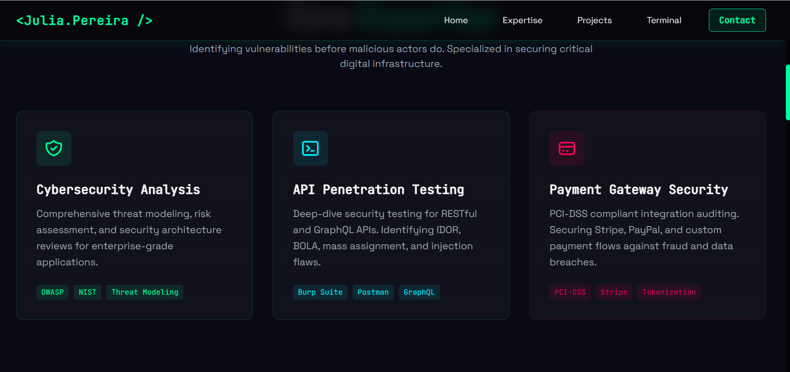

### Portfolio Projects 
In-depth showcases of individual projects, explaining challenges, solutions, and the security measures implemented.
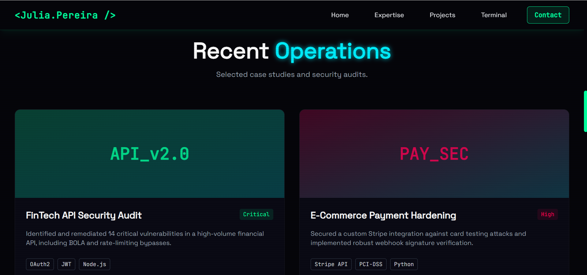
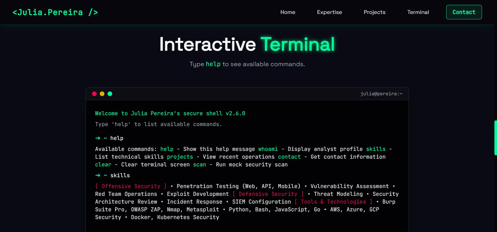

### Contact Section
A dedicated area with contact details and a simple form for inquiries, partnerships, or networking.
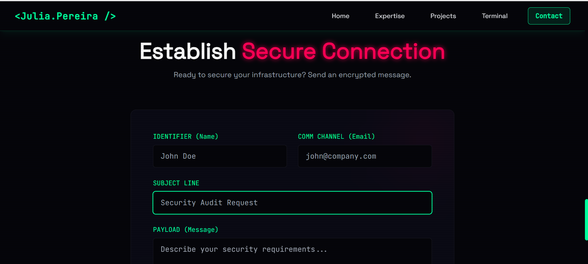
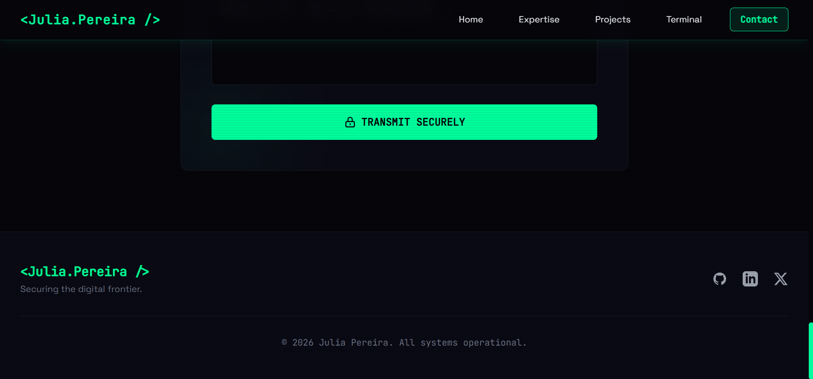

### Technologies Used
- HTML5
- CSS3
- JavaScript
- Git & GitHub

### Security Assessment
As part of this project, I performed a complete security assessment of the website by:

- Identifying common web application vulnerabilities
- Testing for Cross-Site Scripting (XSS)
- Testing for SQL Injection where applicable
- Validating input sanitization
- Reviewing authentication and authorization logic
- Assessing HTTP Security Headers
- Evaluating client-side JavaScript security
- Verifying secure deployment configurations

### Skills Demonstrated
- Frontend Web Development
- Secure Web Development
- Web Application Penetration Testing
- Vulnerability Assessment
- Security Best Practices
- UI/UX Design

## Project 3: Point of Sale (POS) System
A complete retail management application built to automate store inventory tracking, log daily transactional revenues, and render downloadable customer invoice receipts.
*[Click Here to Open the Live Project](https://lb1rd2.github.io/pos/?)*

### Login Page
A secure authentication interface that restricts access to authorized users, helping protect business data and ensuring only authenticated personnel can access the POS system.
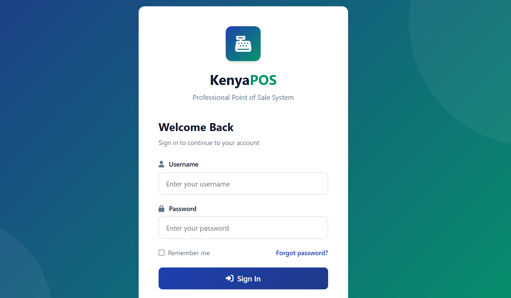

### Dashboard
A centralized dashboard providing an overview of sales performance, inventory status, and key business metrics for quick decision-making. Process customer purchases quickly through an intuitive sales interface with automatic total calculations and receipt generation.
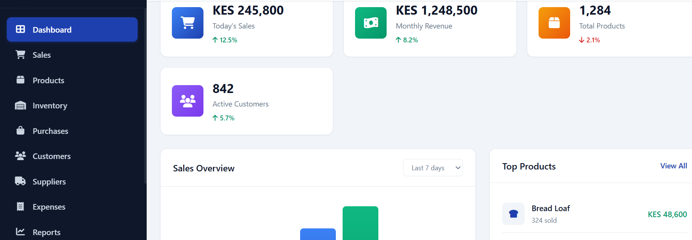

### System Interface
A clean, responsive, and user-friendly interface designed to simplify retail operations and enhance the overall user experience.
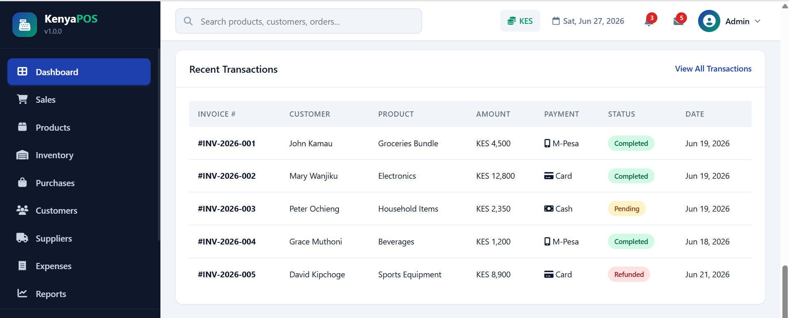

### Inventory & Stock Tracking
Monitor stock levels in real time, helping prevent shortages, reduce overstocking, and improve inventory management.**
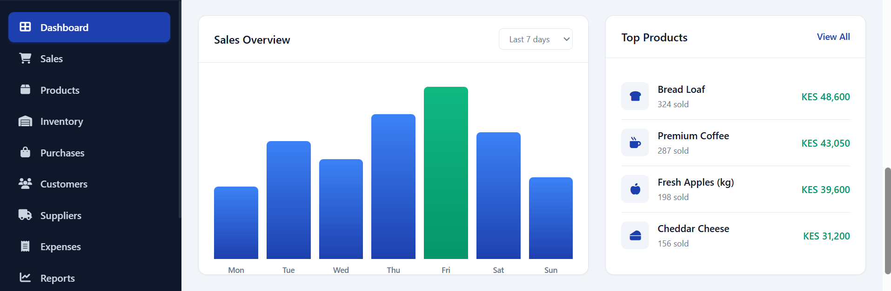

### Product Management
Manage products efficiently by adding, editing, deleting, and organizing inventory with real-time stock updates.
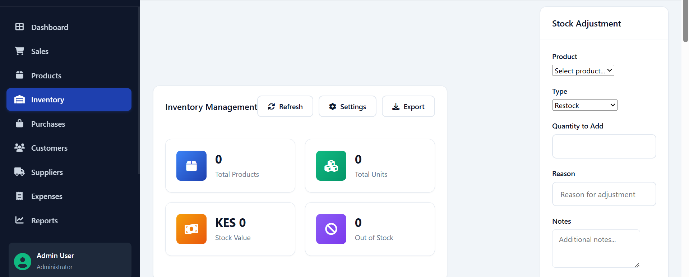

### Inventory & Stock Tracking
Monitor stock levels in real time, helping prevent shortages, reduce overstocking, and improve inventory management.
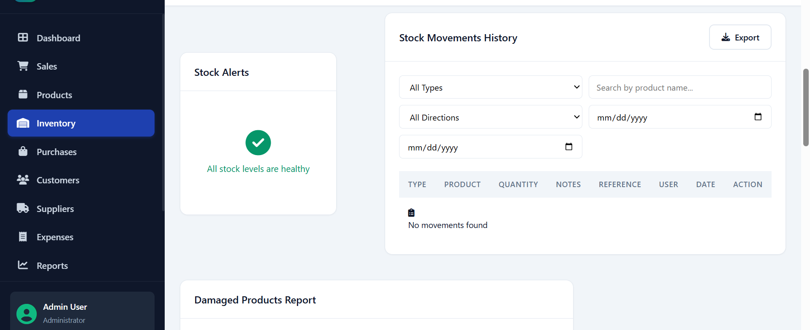

## Other Projects

<!-- Remote File Transfer and PowerShell Fundamentals

This project demonstrates my understanding of secure file transfer techniques and PowerShell-based file delivery methods used in Windows environments from a cybersecurity and system administration perspective.

The work covers multiple approaches to transferring files between local and remote systems, including Remote Desktop Protocol (RDP) through Drive and Clipboard Redirection, Secure File Transfer Protocol (SFTP) over SSH, and PowerShell-based file transfer mechanisms. It also explores PowerShell Base64 encoding and decoding techniques for transferring files without network communication, as well as the use of MD5 hashing to verify file integrity after transfer.

The project further examines PowerShell capabilities for downloading remote resources using the System.Net.WebClient class (DownloadFile(), DownloadFileAsync()) and Invoke-WebRequest (IWR). In addition, it introduces memory-based execution concepts using DownloadString() and Invoke-Expression (IEX), providing insight into techniques commonly encountered during system administration and cybersecurity assessments. -->

## Certifications & Education

My cybersecurity journey combines formal education, professional certifications, and continuous hands-on training in security operations, penetration testing, and secure technology practices.

---

# Academic Education

### Bachelor’s Degree In Cyber Security and Digital Forensics

**Open University of Kenya**  
**Bachelor’s Degree In Cyber Security and Digital Forensics**  
**In Progress**

Relevant areas of study:
- Information Technology
- Computer Networks
- Software Development
- Database Systems
- Systems Administration
- Cybersecurity Fundamentals
- Secure Computing Practices

---

### Diploma in Cyber Security and Ethical Hacking

**Institute of Software Technologies**  
**Diploma in Diploma in Cyber Security and Ethical Hacking**  
**Year Completed - 2023**

Key areas covered:
- Ethical Hacking
- Networking Fundamentals
- Cryptography
- Operating Systems
- IT Support
- Information Security Principles

---

# Professional Cybersecurity Certifications

### Certified Ethical Hacker (CEH)
**Pearson**

Skills developed:
- Ethical hacking methodologies
- Vulnerability assessment
- Network security testing
- Reconnaissance techniques
- Web application security
- Penetration testing fundamentals

---

### Certified API Security Analyst (CASA)
**APIsec University**

Skills developed:
- API security testing
- Authentication and authorization assessment
- API vulnerability identification
- OWASP API Security Top 10
- Secure API design principles

---

### Security Analyst
**Cyber Shujaa**

Skills developed:
- Cybersecurity fundamentals
- Security operations
- Threat awareness
- Practical security labs
- Defensive security concepts

---

### Additional Learning Platforms

**TryHackMe**
- Hands-on cybersecurity labs
- Penetration testing exercises
- Defensive security challenges

**Hack The Box**
- Vulnerability exploitation practice
- Real-world penetration testing scenarios

---

## Curriculum Vitae (CV)

Download my CV:

[📥 Julia_Pereira_CV.pdf](./Julia_Pereira_CV.pdf)

---

## Contact

- **Email:** juliaperirafp@gmail.com.com
- **LinkedIn:** https://linkedin.com/in/julia-pereira-cyber-analyst
- **GitHub:** https://lb1rd2.github.io/portfolio/
- **Hack The Box:** https://app.hackthebox.com/profile/
- **TryHackMe:** https://tryhackme.com/p/

  

  <a href="https://www.credly.com/badges/88e7f87f-a2c0-48e8-9dd9-d00afa50df4b/public_url">
    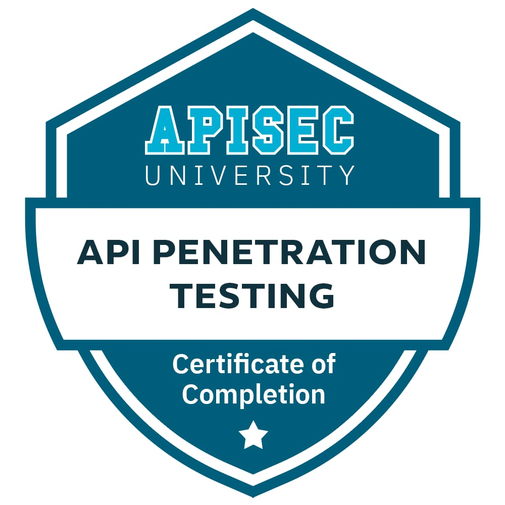
  </a>

  <a href="https://www.credly.com/badges/a107dae3-9350-47cf-8ced-8923b7ac76ad/public_url">

    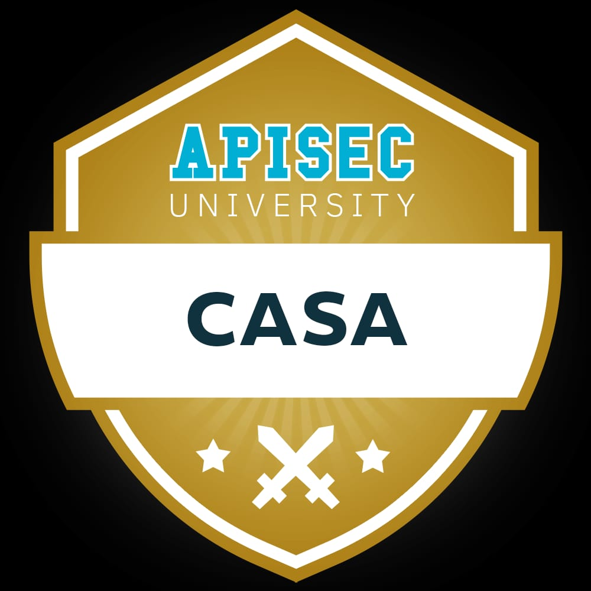
    
  </a>

